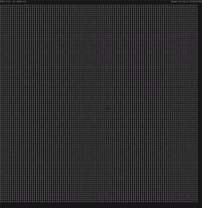
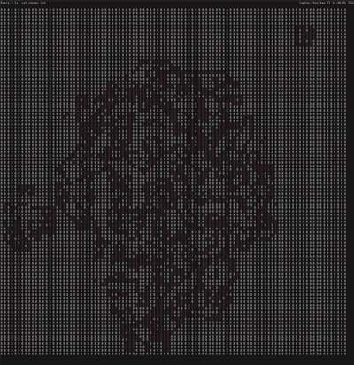

# Matrix Bash Simulation

This project is a cellular automaton simulation implemented in Bash. You can interact with the simulation by changing the "Rule" variable. 1 = life , 0 = void.
> :warning: **Warning:** It was developed on NixOS and has not been tested on other operating systems.
<br>
<p float="left">
  
   
</p>

## Prerequisites

- Bash environment (NixOS recommended)
- `watch` command (for visualization)

## Installation

1. Clone the repository:
   ```
   git clone https://github.com/yourusername/matrix_bash.git
   cd matrix_bash
   ```

2. Ensure all script files are executable:
   ```
   chmod +x *.bash
   ```

## Usage

1. Open two terminal windows and navigate to the project directory in both.

2. In Terminal A (for visualization), run:

   ```
   watch -c -n 0.1 cat render.txt
   ```

3. In Terminal B run:

   - To change the matrix size:

   ```
   ./manage_matrix.bash create -x 10 -y 10 -d . 
   ```

   - To start the simulation:

   ```
   ./manage_simulation.bash start -s 0.1 -d . -r linear_propagation.bash
   ```

4. Control the simulation:
   - Use arrow keys to change the global direction of propagation (only applies on rules).
   - Use number keys (1-6) to change the rule of the simulation:
     1: Linear Propagation
     2: Simple Propagation
     3: Wave Propagation
     4: Geometric Propagation
     5: Life Propagation (Conway's Game of Life)
     6: Mycelium Propagation
   - Press '0' to wipe out everything and restart with 1 cell.
   - Press 'q' to quit the simulation.

## Rules Description

- Linear Propagation: Cells move in a straight line based on the global direction.
- Simple Propagation: Propagate to all adjacent cells
- Wave Propagation: Creates wave-like patterns based on the global direction.
- Geometric Propagation: Forms geometric shapes and patterns without randomness.
- Life Propagation: Implements Conway's Game of Life rules.
- Mycelium Propagation: Simulates the growth patterns of fungal networks.

## Notes

- This simulation was developed and tested on NixOS. Compatibility with other operating systems is not guaranteed.
- Adjusting the simulation speed might be necessary depending on your system's performance.

